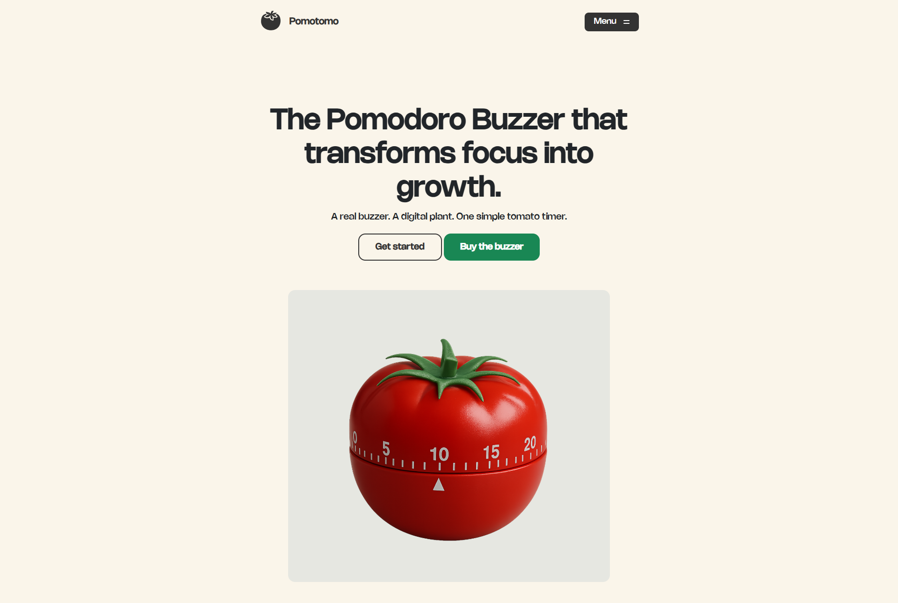
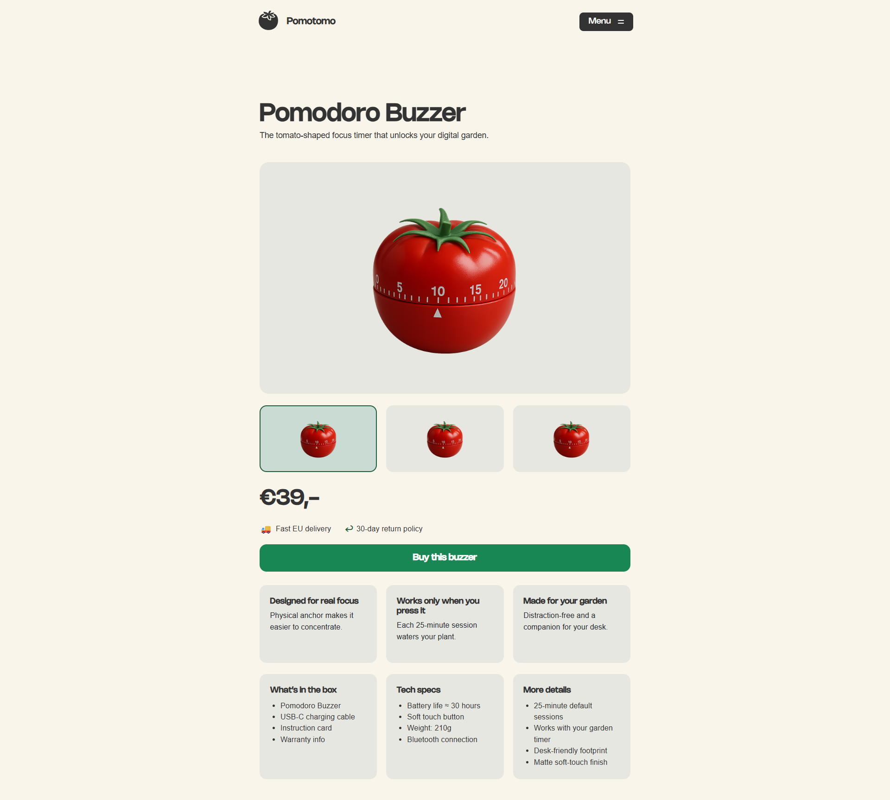
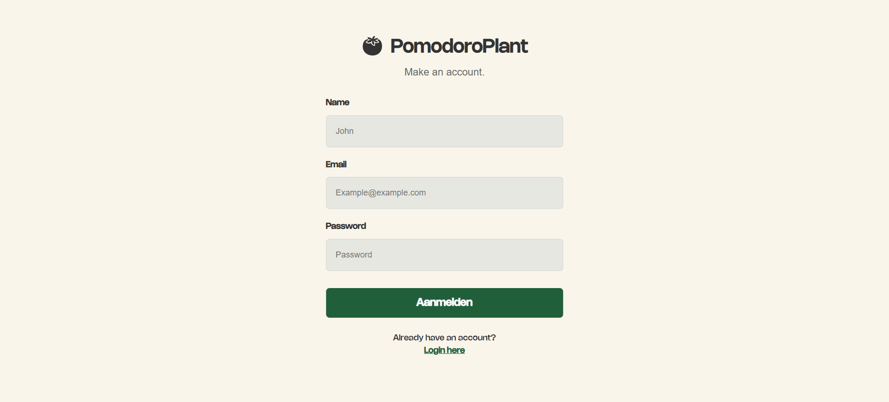
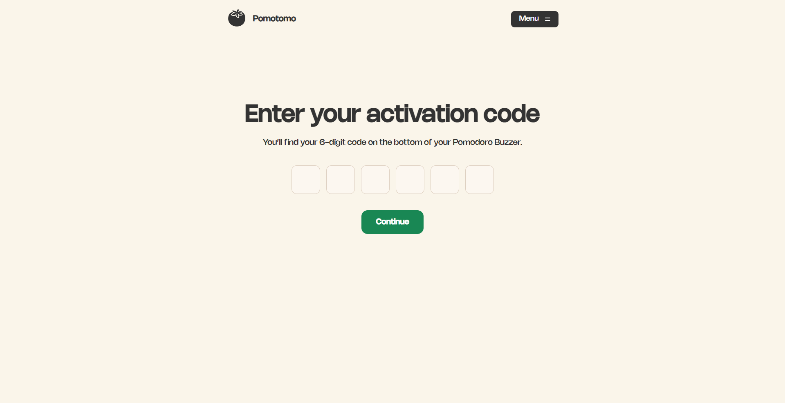
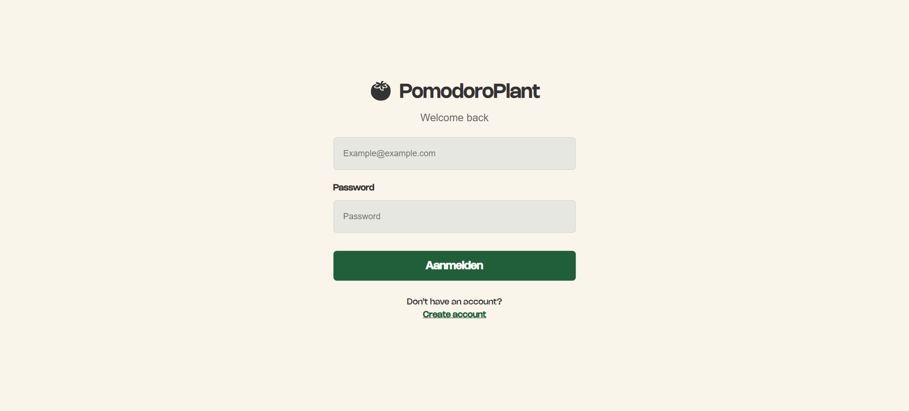
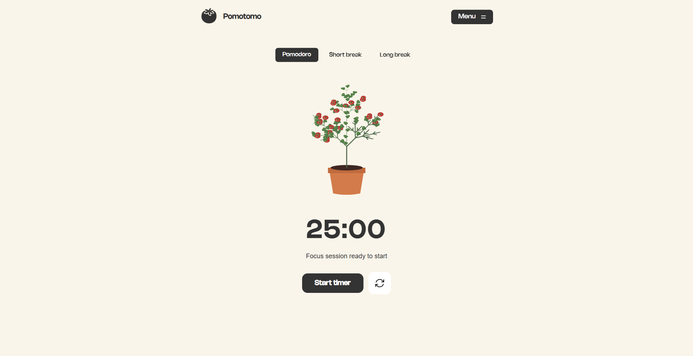
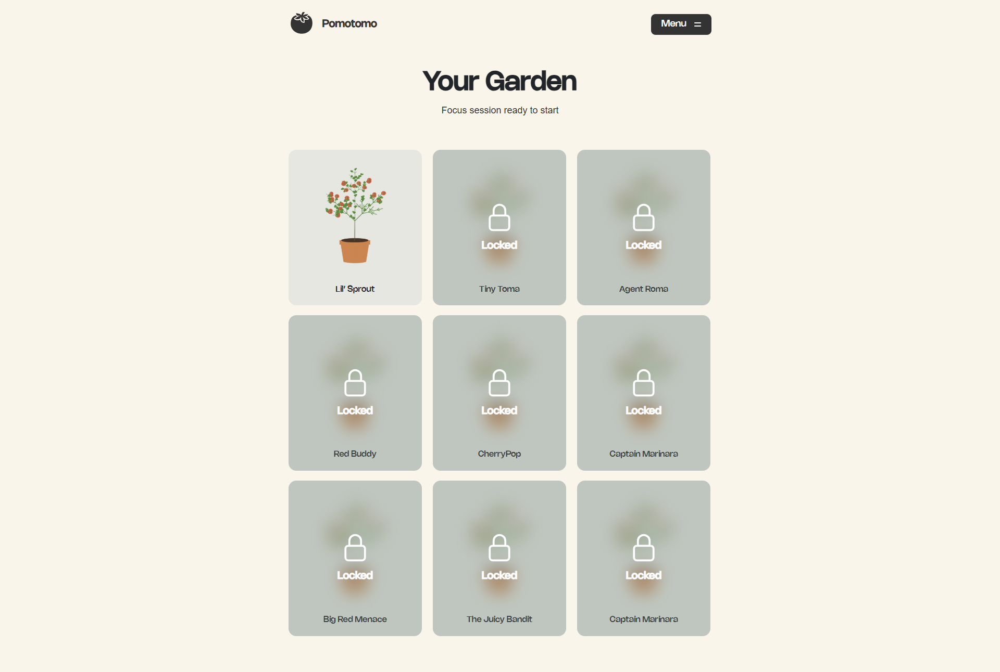
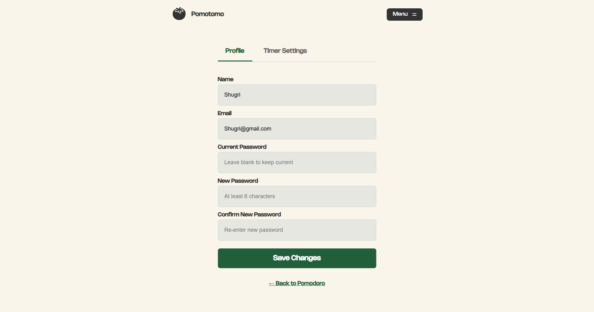

# PomodoroPlant
A focus tool that makes studying easier and more motivating using the Pomodoro method, a growing virtual plant, and a physical buzzer.

## Description

Pomodoro Plant is a web-based productivity tool designed to help students and young adults stay focused during study or work sessions.  
The website combines the proven Pomodoro technique with visual motivation (a virtual plant that grows as you complete sessions) and a physical buzzer that signals the end of each focus block.

### Built with:
- ASP.NET (C#)
- Entity Framework Core (EF Core)
- SQLite
- Bootstrap

---

## Installation

Clone the repository:

````bash
git clone https://github.com/BrahimAit98/PomodoroPlant.git
cd PomodoroPlant
`````

Apply database migrations (SQLite):

```bash
dotnet ef database update
```

Run the project:

```bash
dotnet run
```

Open in your browser:

```text
https://localhost:5001
```

---

## Features

### Pomodoro Timer

* Start, pause, and reset
* Live countdown
* Controls the growth of the virtual plant

### Virtual Plant

* The plant grows as the user completes Pomodoro sessions
* Adds visual motivation and a sense of progress

### Physical Buzzer

* Rings when the session ends
* Helps users stay focused without watching the screen

### Statistics Page

* Completed sessions
* Daily/weekly focus trends
* Total focus time

### User Flow

* Login & Register
* Onboarding
* Home page
* Timer page
* Stats overview
* Garden view

---

## How It Works

1. The user starts a Pomodoro session (e.g., 25 minutes).
2. The timer runs live without page reloads.
3. When the session ends:

   * The buzzer rings
   * The plant grows
   * Session data is saved
4. The statistics page updates automatically, showing progress and trends.

---

## Future Improvements

* Dark mode
* PWA/mobile-friendly mode

---

## Screenshots











---

## Author

**Shugri Farah**
Class Oranje 2025
